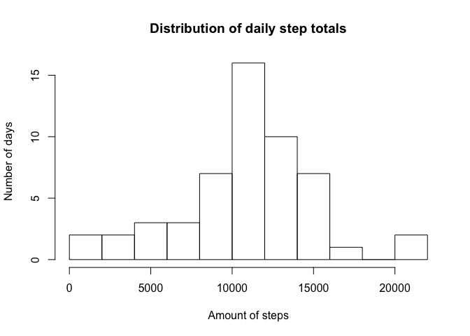

# Reproducible Research: Peer Assessment 1


## Loading and preprocessing the data

```r
activity <- read.csv(unz('activity.zip', 'activity.csv'))
```


## What is mean total number of steps taken per day?

```r
dailysteps <- aggregate(activity$steps, by=list(activity$date), FUN=sum)
hist(dailysteps$x, breaks=8, main="Distribution of daily step totals", xlab="Amount of steps", ylab="Number of days")
```

 

```r
mean(dailysteps$x, na.rm=TRUE)
```

```
## [1] 10766.19
```

```r
median(dailysteps$x, na.rm=TRUE)
```

```
## [1] 10765
```


## What is the average daily activity pattern?

```r
avginterval <- with(activity, aggregate(steps ~ interval, FUN=mean, na.rm=TRUE))
plot(avginterval, type='l', main="Average step total per 5-minute interval", xlab="Time of day", ylab="Amount of steps")
```

 

```r
avginterval[which.max(avginterval$steps), 'interval']
```

```
## [1] 835
```


## Imputing missing values

```r
sum(is.na(activity$steps))
```

```
## [1] 2304
```

The missing data was filled with the correspondent interval averages shown in the latest plot.

```r
activity[is.na(activity$steps), 1] <-
  sapply(activity[is.na(activity$steps), 3],
         function(row) avginterval[avginterval$interval == row, 2])
```


```r
dailysteps <- aggregate(activity$steps, by=list(activity$date), FUN=sum)
hist(dailysteps$x, breaks=8, main="Distribution of daily step totals", xlab="Amount of steps", ylab="Number of days")
```

 

```r
mean(dailysteps$x)
```

```
## [1] 10766.19
```

```r
median(dailysteps$x)
```

```
## [1] 10766.19
```

## Are there differences in activity patterns between weekdays and weekends?
